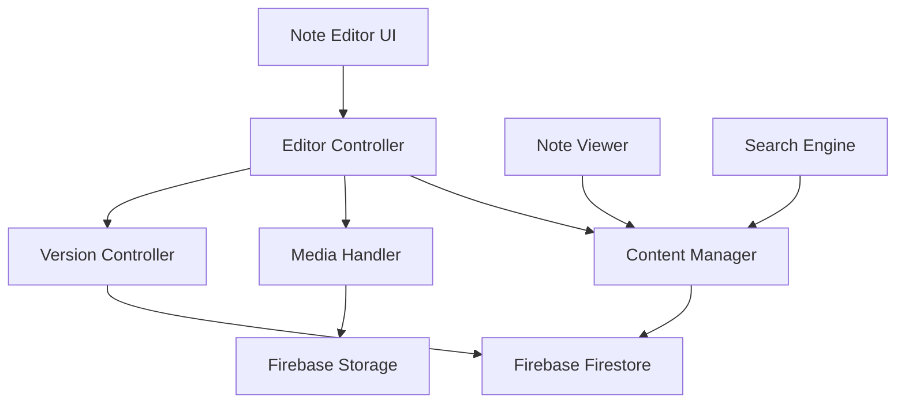

# Design Document: Professional Notes Editing System

## Overview

This design document outlines the architecture and implementation approach for transforming the CODERAFROJ notes system into a professional-level content management platform. The system will provide a rich markdown editing experience with real-time preview, auto-save, version control, media management, and advanced content features.

The design leverages the existing React + Firebase + Tailwind CSS stack and introduces a modular editor architecture that separates concerns between editing, rendering, storage, and media management.

## Architecture

### High-Level Architecture



### Component Hierarchy

```
NoteEditor (Page)
├── EditorToolbar (Component)
│   ├── FormattingButtons
│   ├── MediaUploadButton
│   └── SaveIndicator
├── EditorPane (Component)
│   ├── MarkdownTextarea
│   └── KeyboardShortcutHandler
├── PreviewPane (Component)
│   └── MarkdownRenderer
├── MetadataEditor (Component)
│   ├── TitleInput
│   ├── DescriptionInput
│   ├── FeaturedImageUpload
│   └── TagManager
└── VersionHistory (Component)
    └── VersionList
```

## Components and Interfaces

### 1. NoteEditor Component

**Purpose:** Main container for the note editing interface

**Props:**
```typescript
interface NoteEditorProps {
  noteId?: string;  // undefined for new notes
  mode: 'create' | 'edit';
}
```

**State:**
```typescript
interface EditorState {
  title: string;
  description: string;
  content: string;
  tags: string[];
  featuredImage: string;
  status: 'draft' | 'published';
  lastSaved: Date | null;
  isSaving: boolean;
  hasUnsavedChanges: boolean;
}
```

**Responsibilities:**
- Coordinate between editor pane, preview pane, and metadata editor
- Handle auto-save logic
- Manage editor state
- Handle navigation guards for unsaved changes

### 2. EditorToolbar Component

**Purpose:** Provide formatting controls and actions

**Interface:**
```typescript
interface ToolbarAction {
  icon: ReactNode;
  label: string;
  shortcut: string;
  action: (selection: TextSelection) => void;
}

interface TextSelection {
  start: number;
  end: number;
  text: string;
}
```

**Actions:**
- Bold (Ctrl+B): Wrap with `**text**`
- Italic (Ctrl+I): Wrap with `*text*`
- Heading (Ctrl+H): Prefix with `#`
- Link (Ctrl+K): Insert `[text](url)`
- Code Block: Insert triple backticks
- Image: Trigger media upload
- Save (Ctrl+S): Manual save

### 3. EditorPane Component

**Purpose:** Markdown text input with syntax awareness

**Features:**
- Textarea with markdown syntax
- Tab key handling for indentation
- Keyboard shortcut detection
- Selection tracking for toolbar actions

**Implementation:**
```typescript
interface EditorPaneProps {
  value: string;
  onChange: (value: string) => void;
  onSelectionChange: (selection: TextSelection) => void;
}
```

### 4. PreviewPane Component

**Purpose:** Real-time markdown rendering

**Implementation:**
- Uses `react-markdown` for rendering
- Uses `react-syntax-highlighter` for code blocks
- Debounced updates (300ms) to prevent excessive re-renders
- Custom renderers for enhanced styling

**Custom Renderers:**
```typescript
const components = {
  code: CodeBlock,
  img: OptimizedImage,
  a: ExternalLink,
  h1: StyledHeading,
  // ... other custom components
};
```

### 5. MediaHandler Service

**Purpose:** Handle image uploads and management

**Interface:**
```typescript
interface MediaHandler {
  uploadImage(file: File): Promise<string>;
  deleteImage(url: string): Promise<void>;
  validateImage(file: File): ValidationResult;
  optimizeImage(file: File): Promise<File>;
}

interface ValidationResult {
  valid: boolean;
  error?: string;
}
```

**Upload Flow:**
1. Validate file (type: jpg/png/gif/webp, size: max 5MB)
2. Generate unique filename with timestamp
3. Upload to Firebase Storage at `notes/images/{noteId}/{filename}`
4. Get download URL
5. Insert markdown image syntax into editor

**Storage Structure:**
```
notes/
  images/
    {noteId}/
      {timestamp}-{filename}
```

### 6. AutoSave Manager

**Purpose:** Automatic draft saving

**Implementation:**
```typescript
class AutoSaveManager {
  private saveTimer: NodeJS.Timeout | null = null;
  private readonly SAVE_INTERVAL = 30000; // 30 seconds
  
  scheduleSave(content: EditorState, callback: () => Promise<void>): void;
  cancelSave(): void;
  forceSave(): Promise<void>;
}
```

**Logic:**
- Debounce saves: reset timer on each change
- Save after 30 seconds of inactivity
- Show "Saving..." indicator during save
- Show "Saved at HH:MM" after successful save
- Show error message on failure with retry button

### 7. Version Controller

**Purpose:** Track and manage note versions

**Data Model:**
```typescript
interface NoteVersion {
  versionId: string;
  noteId: string;
  content: string;
  title: string;
  description: string;
  createdAt: Date;
  createdBy: string;
}
```

**Firestore Structure:**
```
notes/{noteId}/versions/{versionId}
  - content: string
  - title: string
  - description: string
  - createdAt: timestamp
  - createdBy: string
```

**Operations:**
- `createVersion()`: Save snapshot on publish
- `listVersions()`: Get all versions for a note
- `getVersion()`: Retrieve specific version
- `restoreVersion()`: Create new version from old one

### 8. TagManager Component

**Purpose:** Tag input with autocomplete

**Implementation:**
```typescript
interface TagManagerProps {
  tags: string[];
  onChange: (tags: string[]) => void;
  suggestions: string[];
}
```

**Features:**
- Input field for new tags
- Autocomplete dropdown showing existing tags
- Tag chips with remove button
- Validation: lowercase, alphanumeric + hyphens only

**Tag Suggestions Query:**
```typescript
// Get all unique tags from published notes
const getTagSuggestions = async (): Promise<string[]> => {
  const snapshot = await getDocs(collection(db, 'notes'));
  const allTags = snapshot.docs.flatMap(doc => doc.data().tags || []);
  return [...new Set(allTags)].sort();
};
```

### 9. Search Engine Enhancement

**Purpose:** Enhanced search across all note fields

**Implementation:**
```typescript
interface SearchQuery {
  term: string;
  tags: string[];
  sortBy: 'date' | 'title' | 'relevance';
  status?: 'draft' | 'published' | 'all';
}

interface SearchResult {
  note: Note;
  highlights: string[];
  score: number;
}
```

**Search Algorithm:**
1. Filter by status (admin sees all, public sees published only)
2. Filter by selected tags (AND logic)
3. Search term matching:
   - Title match: weight 3
   - Description match: weight 2
   - Content match: weight 1
   - Tag match: weight 2
4. Calculate relevance score
5. Sort by selected criteria

## Data Models

### Note Document (Firestore)

```typescript
interface Note {
  id: string;
  title: string;
  description: string;
  content: string;
  featuredImage: string;
  tags: string[];
  status: 'draft' | 'published';
  createdAt: Timestamp;
  updatedAt: Timestamp;
  publishedAt: Timestamp | null;
  author: string;
}
```

### Draft Auto-save Document

```typescript
interface NoteDraft {
  noteId: string;
  title: string;
  description: string;
  content: string;
  tags: string[];
  featuredImage: string;
  lastSaved: Timestamp;
}
```

**Storage:** `drafts/{noteId}` collection for auto-saved drafts

## Correctness Properties

*A property is a characteristic or behavior that should hold true across all valid executions of a system—essentially, a formal statement about what the system should do. Properties serve as the bridge between human-readable specifications and machine-verifiable correctness guarantees.*

### Property 1: Auto-save Persistence
*For any* note being edited, if changes are made and 30 seconds elapse without further changes, then the draft should be saved to Firestore and the save indicator should show "Saved".
**Validates: Requirements 2.2, 2.3**

### Property 2: Image Upload Round-trip
*For any* valid image file uploaded through the media handler, the file should be stored in Firebase Storage and the returned URL should be accessible and point to the uploaded image.
**Validates: Requirements 3.3, 3.4**

### Property 3: Markdown Formatting Consistency
*For any* text selection and formatting action (bold, italic, heading), applying the formatting should insert valid markdown syntax that renders correctly in the preview pane.
**Validates: Requirements 1.2, 1.3, 1.4, 1.8**

### Property 4: Draft Status Exclusion
*For any* note with status 'draft', it should not appear in the public notes listing but should appear in the admin notes listing.
**Validates: Requirements 5.2, 5.4**

### Property 5: Version Creation on Publish
*For any* note that transitions from draft to published status, a version snapshot should be created in the versions subcollection.
**Validates: Requirements 4.1**

### Property 6: Tag Autocomplete Accuracy
*For any* tag input string, the autocomplete suggestions should only include existing tags that start with the input string (case-insensitive).
**Validates: Requirements 6.1**

### Property 7: Search Result Relevance
*For any* search query with a non-empty term, all returned results should contain the search term in at least one of: title, description, content, or tags.
**Validates: Requirements 7.1**

### Property 8: Unsaved Changes Warning
*For any* editor state with unsaved changes, attempting to navigate away should trigger a confirmation dialog.
**Validates: Requirements 2.5**

### Property 9: Keyboard Shortcut Application
*For any* keyboard shortcut (Ctrl+B, Ctrl+I, Ctrl+K, Ctrl+S), pressing the shortcut should execute the corresponding action.
**Validates: Requirements 11.1, 11.2, 11.3, 11.4**

### Property 10: Image Validation
*For any* file selected for upload, if the file type is not an image or size exceeds 5MB, the media handler should reject it with an appropriate error message.
**Validates: Requirements 3.2, 3.6**

### Property 11: Code Block Syntax Highlighting
*For any* code block with a specified language, the rendered output should apply syntax highlighting appropriate to that language.
**Validates: Requirements 8.2**

### Property 12: Metadata Validation
*For any* note save attempt, if the title is empty, the save operation should fail with a validation error.
**Validates: Requirements 10.2**

## Error Handling

### Error Categories

1. **Network Errors**
   - Auto-save failure: Show error, queue for retry
   - Image upload failure: Show error with retry button
   - Load failure: Show error page with reload option

2. **Validation Errors**
   - Empty title: Highlight field, show inline error
   - Invalid image: Show toast notification
   - Invalid tag format: Show inline error

3. **Storage Errors**
   - Quota exceeded: Show error, suggest cleanup
   - Permission denied: Redirect to login
   - Not found: Redirect to notes list

### Error Display Strategy

```typescript
interface ErrorDisplay {
  type: 'toast' | 'inline' | 'modal' | 'page';
  severity: 'error' | 'warning' | 'info';
  message: string;
  action?: {
    label: string;
    handler: () => void;
  };
}
```

**Toast:** Temporary notifications (auto-save, upload success/failure)
**Inline:** Field-level validation errors
**Modal:** Critical errors requiring user action
**Page:** Fatal errors (404, permission denied)

## Testing Strategy

### Unit Tests

**Focus Areas:**
- Markdown formatting functions (bold, italic, heading insertion)
- Tag validation and formatting
- Image file validation
- Search filtering logic
- Version comparison logic

**Example Tests:**
```typescript
describe('Markdown Formatting', () => {
  test('bold formatting wraps text correctly', () => {
    const result = applyBold('hello', 0, 5);
    expect(result).toBe('**hello**');
  });
  
  test('image validation rejects large files', () => {
    const file = createMockFile(6 * 1024 * 1024); // 6MB
    const result = validateImage(file);
    expect(result.valid).toBe(false);
  });
});
```

### Property-Based Tests

**Testing Framework:** Use `fast-check` library for property-based testing in JavaScript/TypeScript

**Configuration:** Minimum 100 iterations per property test

**Property Test Examples:**

```typescript
import fc from 'fast-check';

describe('Property Tests', () => {
  test('Property 1: Auto-save persistence', async () => {
    // Feature: notes-editing-system, Property 1: Auto-save persistence
    await fc.assert(
      fc.asyncProperty(
        fc.record({
          title: fc.string(),
          content: fc.string(),
          description: fc.string(),
        }),
        async (noteData) => {
          const editor = createEditor(noteData);
          await editor.waitForAutoSave(30000);
          const saved = await getDraft(editor.noteId);
          expect(saved.content).toBe(noteData.content);
        }
      ),
      { numRuns: 100 }
    );
  });

  test('Property 3: Markdown formatting consistency', () => {
    // Feature: notes-editing-system, Property 3: Markdown formatting consistency
    fc.assert(
      fc.property(
        fc.string(),
        fc.integer({ min: 0, max: 100 }),
        fc.integer({ min: 0, max: 100 }),
        (text, start, end) => {
          const validStart = Math.min(start, text.length);
          const validEnd = Math.min(Math.max(validStart, end), text.length);
          const formatted = applyBold(text, validStart, validEnd);
          const rendered = renderMarkdown(formatted);
          expect(rendered).toContain('<strong>');
        }
      ),
      { numRuns: 100 }
    );
  });

  test('Property 7: Search result relevance', () => {
    // Feature: notes-editing-system, Property 7: Search result relevance
    fc.assert(
      fc.property(
        fc.array(fc.record({
          title: fc.string(),
          content: fc.string(),
          description: fc.string(),
          tags: fc.array(fc.string()),
        })),
        fc.string({ minLength: 1 }),
        (notes, searchTerm) => {
          const results = searchNotes(notes, searchTerm);
          results.forEach(result => {
            const matchFound = 
              result.title.includes(searchTerm) ||
              result.content.includes(searchTerm) ||
              result.description.includes(searchTerm) ||
              result.tags.some(tag => tag.includes(searchTerm));
            expect(matchFound).toBe(true);
          });
        }
      ),
      { numRuns: 100 }
    );
  });
});
```

### Integration Tests

**Focus Areas:**
- Complete note creation flow
- Image upload and display
- Draft save and restore
- Version creation and restoration
- Search with multiple filters

### Manual Testing Checklist

- [ ] Create new note with all metadata
- [ ] Upload multiple images
- [ ] Test all keyboard shortcuts
- [ ] Test auto-save by waiting 30 seconds
- [ ] Test navigation guard with unsaved changes
- [ ] Publish note and verify it appears in public listing
- [ ] Unpublish note and verify it disappears
- [ ] Create version and restore previous version
- [ ] Test search with various queries
- [ ] Test tag autocomplete
- [ ] Test responsive layout on mobile/tablet/desktop
- [ ] Test error scenarios (network offline, invalid files)

## Implementation Notes

### Libraries to Add

```json
{
  "dependencies": {
    "fast-check": "^3.15.0",
    "react-textarea-autosize": "^8.5.3",
    "use-debounce": "^10.0.0"
  }
}
```

### Firebase Security Rules

```javascript
rules_version = '2';
service cloud.firestore {
  match /databases/{database}/documents {
    match /notes/{noteId} {
      // Public can read published notes
      allow read: if resource.data.status == 'published';
      // Admin can read/write all notes
      allow read, write: if request.auth != null && request.auth.token.admin == true;
      
      match /versions/{versionId} {
        allow read: if request.auth != null && request.auth.token.admin == true;
        allow write: if request.auth != null && request.auth.token.admin == true;
      }
    }
    
    match /drafts/{noteId} {
      allow read, write: if request.auth != null && request.auth.token.admin == true;
    }
  }
}

service firebase.storage {
  match /b/{bucket}/o {
    match /notes/images/{noteId}/{filename} {
      allow read: if true;
      allow write: if request.auth != null && request.auth.token.admin == true
                   && request.resource.size < 5 * 1024 * 1024
                   && request.resource.contentType.matches('image/.*');
    }
  }
}
```

### Performance Considerations

1. **Debouncing:** Preview updates debounced to 300ms
2. **Lazy Loading:** Version history loaded on demand
3. **Image Optimization:** Compress images before upload
4. **Pagination:** Load notes in batches of 20
5. **Caching:** Cache tag suggestions for 5 minutes

### Accessibility

- Keyboard navigation for all editor controls
- ARIA labels for toolbar buttons
- Focus management for modals and dialogs
- Screen reader announcements for save status
- High contrast mode support
